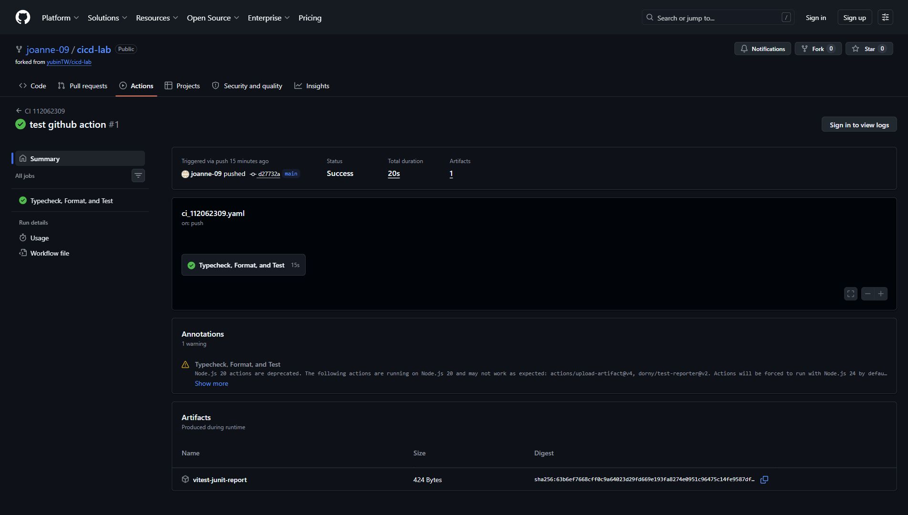
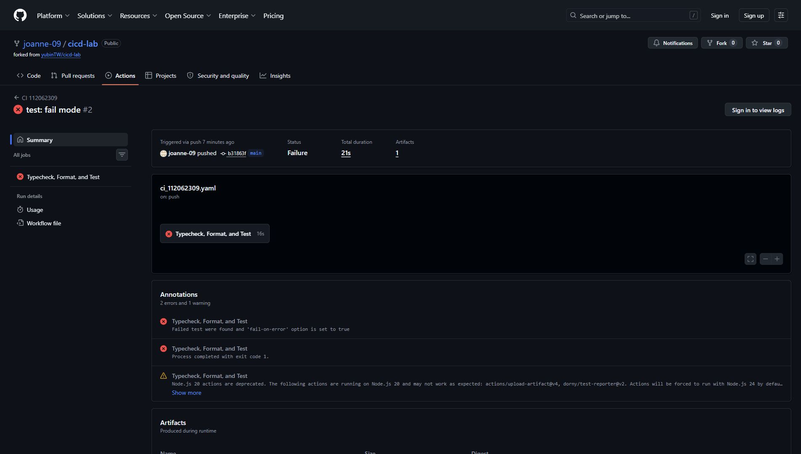

# 112062309 陳芷妍 CICD 作業

## 基本資料

- 學號：112062309
- 姓名：陳芷妍

## 1. CI Pipeline 說明

本作業在專案中新增 `.github/workflows/ci_112062309.yaml`，讓 GitHub Actions 在 push 到任一 branch 時自動執行 CI Pipeline。Pipeline 也支援 `pull_request`，方便之後使用分支或 PR 進行驗證。

Pipeline 使用 `ubuntu-latest` runner 與 Node.js 22。流程先透過 `npm ci` 安裝 `package-lock.json` 鎖定的依賴，接著依序執行 TypeScript typecheck、Prettier check 與 Vitest 測試。任一檢查只要回傳非 0 exit code，GitHub Actions job 就會顯示 failed。

測試階段使用 Vitest 產生 JUnit XML 測試報告，並搭配 `dorny/test-reporter@v2` 將測試結果顯示在 GitHub Actions 結果頁面。同時使用 `actions/upload-artifact@v4` 上傳 `vitest-junit-report`，方便下載與留存測試結果。

## 2. Workflow 主要內容

以下為 `.github/workflows/ci_112062309.yaml` 的主要內容，包含 push 觸發、三個必要檢查，以及測試結果發布設定。

```yaml
name: CI 112062309

on:
  push:
    branches:
      - '**'
  pull_request:

permissions:
  contents: read
  checks: write
  actions: read

jobs:
  quality:
    name: Typecheck, Format, and Test
    runs-on: ubuntu-latest

    steps:
      - uses: actions/checkout@v5

      - uses: actions/setup-node@v5
        with:
          node-version: '22'
          cache: npm

      - run: npm ci
      - run: npm run typecheck
      - run: npm run format:check

      - name: Run tests with JUnit report
        run: |
          mkdir -p reports
          npm run test:ci

      - name: Publish test results
        if: ${{ always() && hashFiles('reports/vitest-junit.xml') != '' }}
        uses: dorny/test-reporter@v2
        with:
          name: Vitest Test Results
          path: reports/vitest-junit.xml
          reporter: java-junit

      - uses: actions/upload-artifact@v4
        if: ${{ always() && hashFiles('reports/vitest-junit.xml') != '' }}
        with:
          name: vitest-junit-report
          path: reports/vitest-junit.xml
```

## 3. CI 成功執行結果

成功案例為 GitHub Actions run #1，commit 訊息為 `test github action`。畫面顯示 workflow `CI 112062309` 執行成功，job `Typecheck, Format, and Test` 為綠色通過，並產出 1 個 `vitest-junit-report` artifact。登入後的 GitHub Actions summary 顯示測試結果為 2 passed、0 failed、0 skipped。



圖 1：GitHub Actions 成功執行頁面，CI job 通過並產生測試報告 artifact。

## 4. 失敗案例說明

失敗案例選擇測試失敗。為了故意讓 pipeline failed，我暫時修改 `test/app.test.ts` 中 `/health` endpoint 的測試預期值。原本 API 正確回傳 `{ status: 'ok' }`，但測試被改成期待 `{ status: 'broken' }`。

```ts
expect(response.json()).toEqual({ status: 'broken' });
```

因此 TypeScript typecheck 和 Prettier check 仍可通過，但 Vitest 測試階段會失敗，錯誤原因如下：

```text
AssertionError: expected { status: 'ok' } to deeply equal { status: 'broken' }
```

GitHub Actions 失敗 run #2 顯示 workflow failed，測試結果為 1 passed、1 failed、0 skipped。失敗原因是測試預期值與實際 API response 不一致。



圖 2：GitHub Actions 失敗執行頁面，失敗原因為 `/health` 測試預期值錯誤。

## 5. 修正方式

修正方式是將測試預期值從 `{ status: 'broken' }` 改回實際 API 會回傳的 `{ status: 'ok' }`。

```ts
expect(response.json()).toEqual({ status: 'ok' });
```

修正後重新執行本機檢查，三項檢查皆通過：

```text
npm.cmd run typecheck     # pass
npm.cmd run format:check  # pass
npm.cmd run test:ci       # 2 tests passed
```

重新 push 修正 commit 後，GitHub Actions CI Pipeline 即可恢復成功狀態。

## 6. 結論

透過這次作業，我比較實際地理解 CI Pipeline 在專案中的用途。以前可能只會在本機手動跑測試，但這次把 typecheck、Prettier check 和 test 都放進 GitHub Actions 後，只要 push 程式碼，系統就會自動幫忙檢查，成功或失敗也都可以直接在 Actions 頁面看到，對團隊開發來說比較不容易漏掉問題。

當故意把測試預期結果改錯時，pipeline 會直接 failed，並在測試報告中顯示是哪一個 test 沒有通過。這樣比單純看到程式不能跑更清楚，因為可以從錯誤訊息快速判斷問題是測試預期值和 API 回傳結果不一致。

整體來說，這次實作讓我知道 CI 不只是把指令搬到 GitHub 上執行而已，而是把專案需要遵守的品質檢查流程固定下來。之後如果專案變大或多人一起開發，這樣的 pipeline 可以幫忙在程式合併前先抓出型別、格式或測試問題，讓程式碼品質比較穩定，也比較容易追蹤錯誤原因。
